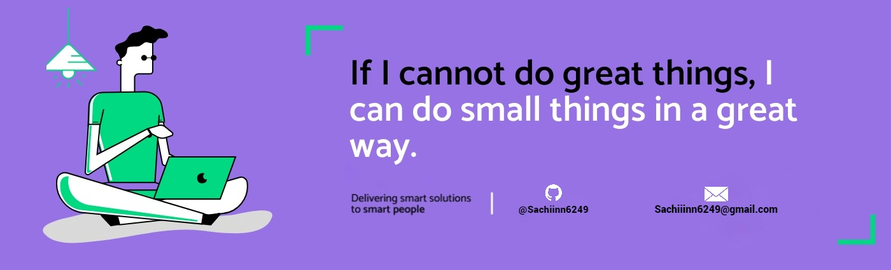

<h1 align="center">Hello I'm Sachin Babu</h1>

  
  

  

## 👨🏻‍💻 About Me:

- 🙋‍♂️ All about me 

- 🔭 I’m currently working on `Something Intresting`.

- 🌱 I’m currently deep learning `MERN Stack`

- 👯 I’m looking to collaborate for `Dev Projects`

- 🤔 I’m looking for help with `Competitive Programming`

- 👨‍💻 Life Hack: Learn new tech :fire: and keep updated :tada:

- ⚡ Life Goal: Zero to Hero

## 🛠️ Technologies and Tools I use:

 

 
 

## 📊 My GitHub Data:

  
  

